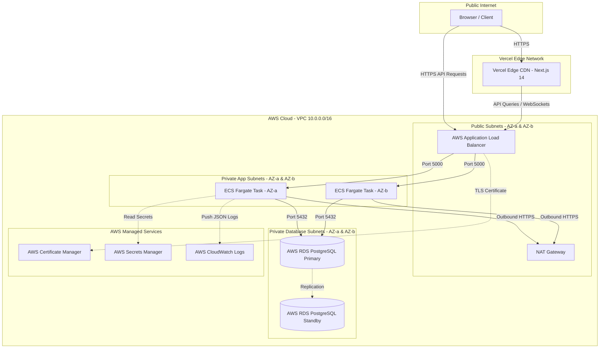

# AWS PRODUCTION DEPLOYMENT STRATEGY & CLOUD ARCHITECTURE

This document details the production cloud deployment strategy, network topology, security model, container orchestration via **AWS ECS Fargate**, database hosting on **AWS RDS PostgreSQL**, and frontend integration with **Vercel** for the **Mini Operations ERP** platform.

Target Docker Hub Repository: `sandeepj07/mini-operations-erp-backend`

---

## 1. Cloud Architecture Overview

The system utilizes a hybrid serverless container & Edge CDN deployment model:
* **Frontend Layer**: Next.js 14 hosted on **Vercel** with global Edge CDN caching and Serverless Functions.
* **API Container Layer**: Node.js/Express API packaged as Docker containers (`sandeepj07/mini-operations-erp-backend`) running on **AWS ECS Fargate** across multiple Availability Zones (AZs).
* **Database Layer**: **AWS RDS PostgreSQL 15** in Multi-AZ configuration with automated failover and KMS storage encryption.
* **Edge Routing & SSL**: **AWS Application Load Balancer (ALB)** with HTTPS/TLS termination via **AWS Certificate Manager (ACM)**.

### Production System Architecture Diagram



---

## 2. VPC Network Topology & Security Model

To prevent unauthorized database exposure, the AWS Virtual Private Cloud (VPC) enforces 3 distinct network tiers across 2 Availability Zones (`us-east-1a`, `us-east-1b`):

### Subnet Layout (`10.0.0.0/16`)

| Subnet Tier | CIDR Block (AZ-a) | CIDR Block (AZ-b) | Exposure | Contained Resources |
| :--- | :--- | :--- | :--- | :--- |
| **Public Subnet** | `10.0.1.0/24` | `10.0.2.0/24` | Internet Facing | Application Load Balancer, NAT Gateways |
| **Private App Subnet** | `10.0.10.0/24` | `10.0.20.0/24` | Internal Only | ECS Fargate Backend Tasks |
| **Private DB Subnet** | `10.0.100.0/24` | `10.0.200.0/24` | Isolated | AWS RDS PostgreSQL Primary & Standby |

### Security Group (SG) Cascading Firewall Rules

```
[ Internet ] ──► (Inbound 80/443) ──► [ ALB SG ] ──► (Inbound 5000) ──► [ ECS SG ] ──► (Inbound 5432) ──► [ RDS SG ]
```

1. **`ALB-SG` (Load Balancer Security Group)**:
   * **Inbound**: Accept HTTP (`80`) and HTTPS (`443`) from `0.0.0.0/0`.
   * **Outbound**: Allow TCP port `5000` to `ECS-SG` only.
2. **`ECS-SG` (Application Security Group)**:
   * **Inbound**: Allow TCP port `5000` ONLY from `ALB-SG`. Direct access from the internet is completely blocked.
   * **Outbound**: Allow TCP port `5432` to `RDS-SG` and HTTPS port `443` to NAT Gateway (for pulling container images and AWS API calls).
3. **`RDS-SG` (Database Security Group)**:
   * **Inbound**: Allow PostgreSQL TCP port `5432` ONLY from `ECS-SG`.
   * **Outbound**: None (Zero outbound rules).

---

## 3. Container Orchestration & Scaling (AWS ECS Fargate)

Backend containers are deployed using AWS ECS Fargate, providing serverless execution without managing EC2 instances.

### Task Definition Configuration
* **Container Image**: `sandeepj07/mini-operations-erp-backend:latest`
* **vCPU / Memory**: `0.25 vCPU` (256 CPU units), `512 MB RAM` per task.
* **Operating System**: Linux/ARM64 or x86_64 (`node:20-alpine`).
* **Environment Variables**:
  * `NODE_ENV`: `"production"`
  * `PORT`: `"5000"`
  * `FRONTEND_URL`: `"https://mini-operations-erp.vercel.app"`
* **Secrets Ingestion (from AWS Secrets Manager)**:
  * `DATABASE_URL`: `arn:aws:secretsmanager:us-east-1:123456789012:secret:erp/db_url`
  * `JWT_SECRET`: `arn:aws:secretsmanager:us-east-1:123456789012:secret:erp/jwt_secret`

### ECS Target Tracking Auto-Scaling Policy
* **Min Tasks**: `2` (Guarantees multi-AZ fault tolerance).
* **Max Tasks**: `10`.
* **Scale-Out Triggers**:
  * Average CPU Utilization > `70%` for 2 consecutive minutes.
  * Target ALB Request Count > `1,000 requests/minute` per task.

---

## 4. Database Provisioning (AWS RDS PostgreSQL)

* **Engine**: PostgreSQL 15.7
* **Deployment Option**: Multi-AZ instance (Automatic synchronous replication to secondary standby in AZ-b).
* **Instance Class**: `db.t4g.micro` (Development) / `db.r6g.large` (Production).
* **Storage**: `20 GB` GP3 (Auto-scaling enabled up to 100 GB).
* **Backups**: Automated daily snapshots with 7-day point-in-time recovery (PITR).
* **Encryption**: Enabled using AWS KMS managed master key (`aws/rds`).

---

## 5. Terraform Infrastructure-as-Code Blueprint

Below is the production Terraform configuration for provisioning the AWS ECS Fargate & ALB infrastructure:

```hcl
# main.tf - AWS Infrastructure Provisioning for Mini Operations ERP

terraform {
  required_providers {
    aws = {
      source  = "hashicorp/aws"
      version = "~> 5.0"
    }
  }
}

provider "aws" {
  region = "us-east-1"
}

# 1. ECS Cluster
resource "aws_ecs_cluster" "erp_cluster" {
  name = "mini-operations-erp-cluster"
}

# 2. ECS Task Definition
resource "aws_ecs_task_definition" "erp_task" {
  family                   = "mini-operations-erp-backend"
  network_mode             = "awsvpc"
  requires_compatibilities = ["FARGATE"]
  cpu                      = "256"
  memory                   = "512"
  execution_role_arn       = aws_iam_role.ecs_execution_role.arn

  container_definitions = jsonencode([
    {
      name      = "erp-backend"
      image     = "docker.io/sandeepj07/mini-operations-erp-backend:latest"
      essential = true
      portMappings = [
        {
          containerPort = 5000
          hostPort      = 5000
        }
      ]
      environment = [
        { name = "NODE_ENV", value = "production" },
        { name = "PORT", value = "5000" }
      ]
      secrets = [
        { name = "DATABASE_URL", valueFrom = "${aws_secretsmanager_secret.db_secret.arn}:DATABASE_URL::" },
        { name = "JWT_SECRET", valueFrom = "${aws_secretsmanager_secret.jwt_secret.arn}:JWT_SECRET::" }
      ]
      logConfiguration = {
        logDriver = "awslogs"
        options = {
          "awslogs-group"         = "/ecs/mini-operations-erp"
          "awslogs-region"        = "us-east-1"
          "awslogs-stream-prefix" = "backend"
        }
      }
    }
  ])
}

# 3. ECS Fargate Service
resource "aws_ecs_service" "erp_service" {
  name            = "mini-operations-erp-service"
  cluster         = aws_ecs_cluster.erp_cluster.id
  task_definition = aws_ecs_task_definition.erp_task.arn
  desired_count   = 2
  launch_type     = "FARGATE"

  network_configuration {
    subnets          = [aws_subnet.private_app_a.id, aws_subnet.private_app_b.id]
    security_groups  = [aws_security_group.ecs_sg.id]
    assign_public_ip = false
  }

  load_balancer {
    target_group_arn = aws_lb_target_group.erp_target_group.arn
    container_name   = "erp-backend"
    container_port   = 5000
  }
}
```

---

## 6. Estimated Monthly Cost Breakdown

| Component | AWS Resource | Dev / Test Tier (Monthly) | Production Tier (Monthly) |
| :--- | :--- | :--- | :--- |
| **Compute** | ECS Fargate (2 Tasks 24/7) | ~$15.00 | ~$30.00 |
| **Database** | AWS RDS PostgreSQL (`db.t4g.micro`) | Free Tier / ~$14.00 | ~$75.00 (Multi-AZ `db.r6g.large`) |
| **Load Balancer** | AWS ALB | ~$18.00 | ~$22.00 |
| **Network & Logs** | NAT Gateway & CloudWatch | ~$5.00 | ~$15.00 |
| **Frontend** | Vercel Hobby / Pro | $0.00 (Free) | $20.00 |
| **TOTAL** | | **~$52.00 / month** | **~$162.00 / month** |
