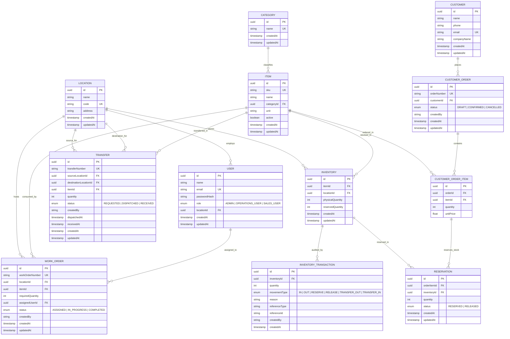

# Database ER Diagram - Mini Operations ERP

This document contains the Entity-Relationship Diagram for the **Mini Operations ERP** PostgreSQL database hosted on Supabase.

```mermaid
erDiagram
    LOCATION ||--o{ USER : "employs"
    LOCATION ||--o{ INVENTORY : "stores"
    LOCATION ||--o{ WORK_ORDER : "hosts"
    LOCATION ||--o{ TRANSFER : "source_for"
    LOCATION ||--o{ TRANSFER : "destination_for"

    CATEGORY ||--o{ ITEM : "classifies"
    
    ITEM ||--o{ INVENTORY : "stocked_in"
    ITEM ||--o{ WORK_ORDER : "consumed_by"
    ITEM ||--o{ TRANSFER : "transferred_in"
    ITEM ||--o{ CUSTOMER_ORDER_ITEM : "ordered_in"

    INVENTORY ||--o{ INVENTORY_TRANSACTION : "audited_by"
    INVENTORY ||--o{ RESERVATION : "reserved_in"

    USER ||--o{ WORK_ORDER : "assigned_to"

    CUSTOMER ||--o{ CUSTOMER_ORDER : "places"

    CUSTOMER_ORDER ||--o{ CUSTOMER_ORDER_ITEM : "contains"
    CUSTOMER_ORDER_ITEM ||--o{ RESERVATION : "reserves_stock"

    USER {
        uuid id PK
        string name
        string email UK
        string passwordHash
        enum role "ADMIN | OPERATIONS_USER | SALES_USER"
        uuid locationId FK
        timestamp createdAt
        timestamp updatedAt
    }

    LOCATION {
        uuid id PK
        string name
        string code UK
        string address
        timestamp createdAt
        timestamp updatedAt
    }

    CATEGORY {
        uuid id PK
        string name UK
        timestamp createdAt
        timestamp updatedAt
    }

    ITEM {
        uuid id PK
        string sku UK
        string name
        uuid categoryId FK
        string unit
        boolean active
        timestamp createdAt
        timestamp updatedAt
    }

    INVENTORY {
        uuid id PK
        uuid itemId FK
        uuid locationId FK
        int physicalQuantity
        int reservedQuantity
        timestamp createdAt
        timestamp updatedAt
    }

    INVENTORY_TRANSACTION {
        uuid id PK
        uuid inventoryId FK
        int quantity
        enum movementType "IN | OUT | RESERVE | RELEASE | TRANSFER_OUT | TRANSFER_IN"
        string reason
        string referenceType
        string referenceId
        string createdBy
        timestamp createdAt
    }

    WORK_ORDER {
        uuid id PK
        string workOrderNumber UK
        uuid locationId FK
        uuid itemId FK
        int requiredQuantity
        uuid assignedUserId FK
        enum status "ASSIGNED | IN_PROGRESS | COMPLETED"
        string createdBy
        timestamp createdAt
        timestamp updatedAt
    }

    TRANSFER {
        uuid id PK
        string transferNumber UK
        uuid sourceLocationId FK
        uuid destinationLocationId FK
        uuid itemId FK
        int quantity
        enum status "REQUESTED | DISPATCHED | RECEIVED"
        string createdBy
        timestamp dispatchedAt
        timestamp receivedAt
        timestamp createdAt
        timestamp updatedAt
    }

    CUSTOMER {
        uuid id PK
        string name
        string phone
        string email UK
        string companyName
        timestamp createdAt
        timestamp updatedAt
    }

    CUSTOMER_ORDER {
        uuid id PK
        string orderNumber UK
        uuid customerId FK
        enum status "DRAFT | CONFIRMED | CANCELLED"
        string createdBy
        timestamp createdAt
        timestamp updatedAt
    }

    CUSTOMER_ORDER_ITEM {
        uuid id PK
        uuid orderId FK
        uuid itemId FK
        int quantity
        float unitPrice
    }

    RESERVATION {
        uuid id PK
        uuid orderItemId FK
        uuid inventoryId FK
        int quantity
        enum status "RESERVED | RELEASED"
        timestamp createdAt
        timestamp updatedAt
    }
```
